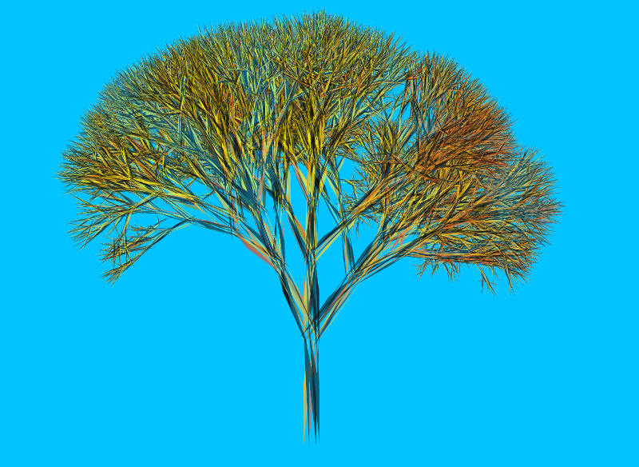
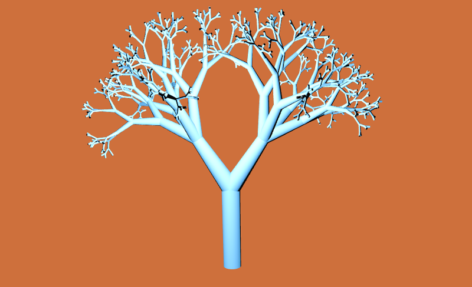

# ofxLSystem

This addon has a dependency on [ofxLSystemGrammar](https://github.com/edap/ofxLSystemGrammar). Download it and add it to your addon folder

ofxLSystem is a 3D graphic turtle graphic interpretation of L-Syestems. In the readme of ofxLSystemGrammar you can find some information about L-System.
This addon can be used to generate meshes as the following ones:





## Supported platforms

It is currently tested on:

*mac* and OF  0.9.3

*linux* g++ 4.9 and OF version 0.9.3. On linux, you need g++ >= 4.9 and the `-std=gnu++14` flag. Otherwise you will have an error about `std::regex_iterator`. This flag is the default on OF 0.9.3, just in case you set it to `std=c++11` as described in this [post]( https://forum.openframeworks.cc/t/openframeworks-0-9-qtcreator/21312/7).

## Usage

In your header file include `ofxLSystem` and declare an instance of it. Declare also a material, it will be applied to the tree's mesh.

```cpp
#include "ofxLSystem.h"
// ...
ofxLSystem tree
ofMaterial treeMaterial
```

In your `ofApp.cpp`

```cpp
void ofApp::setup(){
  treeMaterial.setDiffuseColor(ofFloatColor::blueSteel)
  tree.setStep(4);
  tree.build();
}


void ofApp::draw(){
  treeMaterial.begin();
  tree.draw();
  treeMaterial.end();
}
```

`tree.setAxiom("F")` tells to ofxLSystem to use `F` as axiom, `tree.setRules({"F -> FF[+F][-F]"})` to use `F -> FF[+F][-F]` as reproduction rule and `tree.setStep(4)` to iterate 4 times. Have a look into ofxLSystemGrammar or in the 2 examples in this project for more L-System examples.

By default, each L-System is initialized with this parameters:

```cpp
typedef map<string,float> Constants;

vector<string>    rulesContainer = {"F -> F[+F][-F]"};
string            axiom = "F";
bool              randomYRotation = false;
int               depth = 1;
float             theta = 25.00;
float             stepWidth = 10.00;
bool              scaleWidth = false;
float             stepLength = 100.00;
map<string,float> constants = Constants();
```

you can overwrite the default parameters using these methods:

```cpp
void setAxiom(string _axiom);
void setRules(vector<string> _rulesContainer);
void setTheta(float _theta);
void setRandomZRotation(bool _randomYRotation);
void setStep(int _depth);
void setScaleWidth(bool _scaleWidht);
void setStepWidth(float _stepWidth);
void setStepLength(float _stepLength);
void setConstants(map<string,float> _Constants);
```

For example, the following snippet:

```cpp
ofxLSystem tree;
map<string, float> constants;
constants.insert(make_pair("R", 1.456));

tree.setAxiom("A(100)");
tree.setRules({"A(s) -> F(s)[+A(s/R)][-A(s/R)]"});
tree.setRandomYRotation(true);
tree.setConstants(constants);
tree.setStep(4);
tree.setScaleWidth(true);
tree.setStepLength(90);
```

Generates a tree like this:




## Examples

- *example-gui* contains ~10 differents L-Systems, with a GUI to change colors, rotation angle, n steps ecc. It saves the settings for each tree on a separate xml file
- *example-forest* An example on how you can build a forest merging the meshes of 60 trees in one  
- *example-shader* I've added some simple shaders following "the book of shader" of Patricio Gonzalo Vivo.
- *example-rings* A shader draw rings of light on the surface of the trees, these rings are animated by some music (if requires ofxMaxim as dependency)
