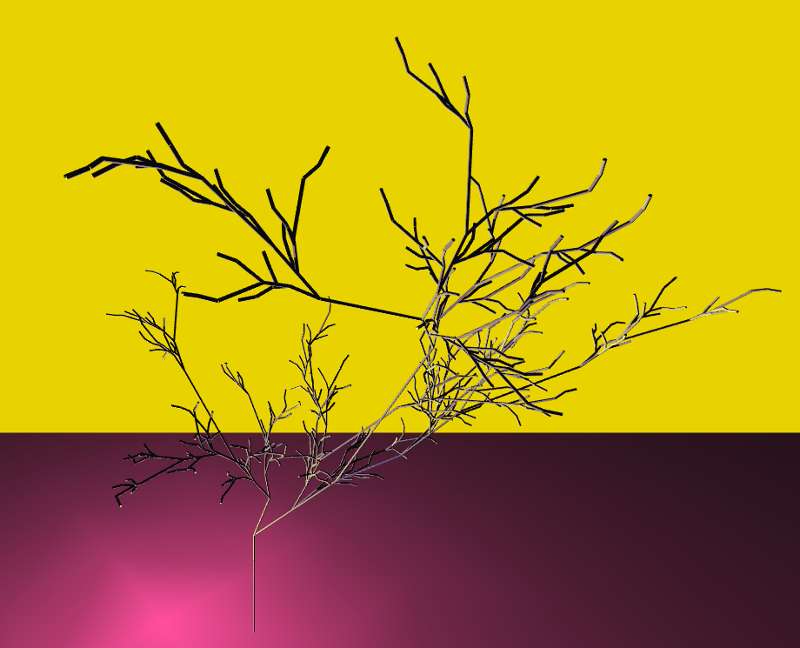
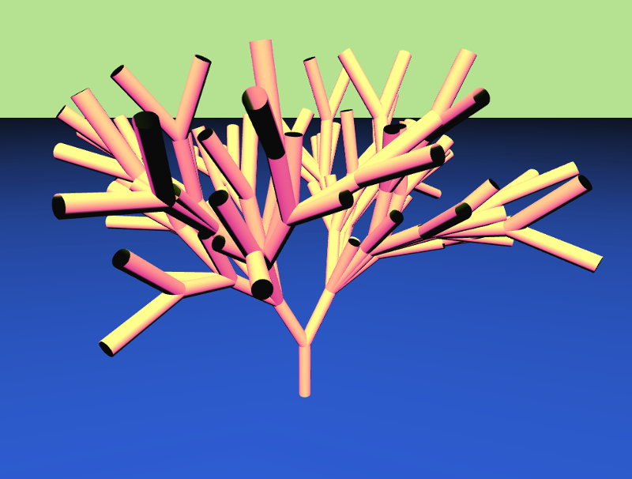
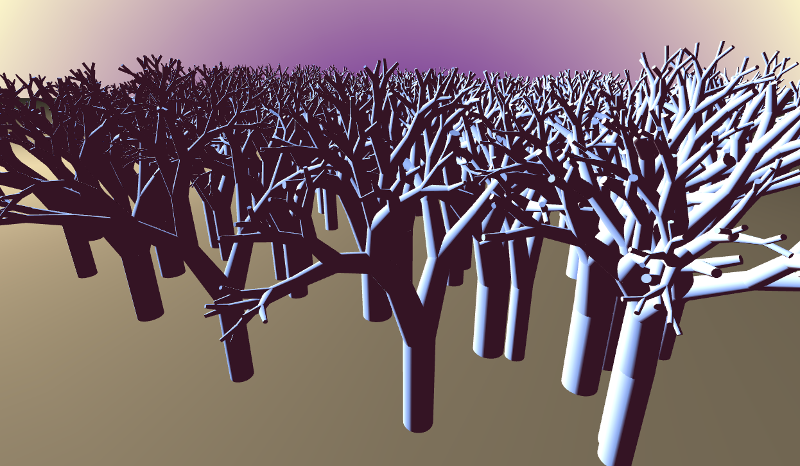

# ofxLSystem

This addon has a dependency on [ofxLSystemGrammar](https://github.com/edap/ofxLSystemGrammar). Download it and add it to your addon folder

ofxLSystem is a 3D graphic turtle graphic interpretation of L-Syestems. In the readme of ofxLSystemGrammar you can find some information about L-System.
This addon can be used to generate meshes as the following ones:






## Supported platforms

It is currently tested on:
*mac* and OF  0.9.3

*linux* g++ 4.9 and OF version 0.9.3. On linux, you need g++ >= 4.9 and the `-std=gnu++14` flag. Otherwise you will have an error about `std::regex_iterator`. This flag is the default on OF 0.9.3, just in case you set it to `std=c++11` as described in this (post)[https://forum.openframeworks.cc/t/openframeworks-0-9-qtcreator/21312/7].

## Usage

In your header file include `ofxLSystem` and declare an instance of it. Declare also a material, it will be applied to the tree's mesh.

```cpp
#include "ofxLSystem.h"
// ...
ofxLSystem tree
ofMaterial treeMaterial
```

In your `ofApp.cpp` 

```cpp
void ofApp::setup(){
  treeMaterial.setDiffuseColor(ofFloatColor::blueSteel)
  tree.setup("F", vector<string>{"F -> FF[+F][-F]"}, 4);
  tree.build();
}


void ofApp::draw(){
  treeMaterial.begin();
  tree.draw();
  treeMaterial.end();
}
```

In `tree.setup("F", vector<string>{"F -> FF[+F][-F]"}, 4)` we tell to ofxLSystem to use `F` as axiom, to use `F -> FF[+F][-F]` as reproduction rule and to iterate 4 times. Have a look into ofxLSystemGrammar or in the 2 examples in this project for more L-System examples.

To see how to pass other parameters, check the signature of the `ofxLSystem` constructor.

## Examples

- *guiExample* contains ~10 differents L-Systems, with a GUI to change colors, rotation angle, n steps ecc. It saves the settings for each tree on a separate xml file
- *exampleForest* It use a `vector<ofxLSystem>` to create a forest of ~80 trees.
